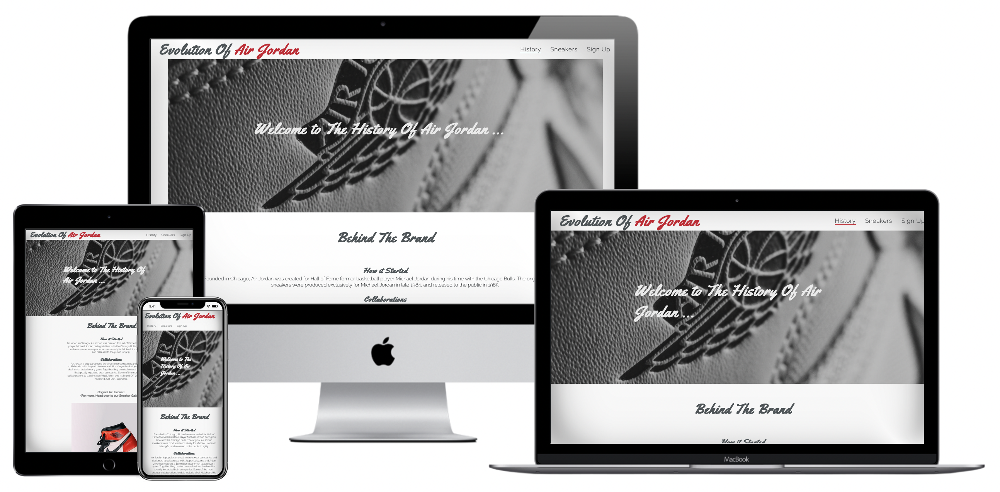
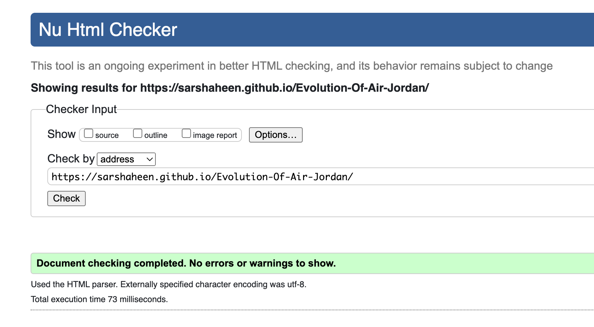
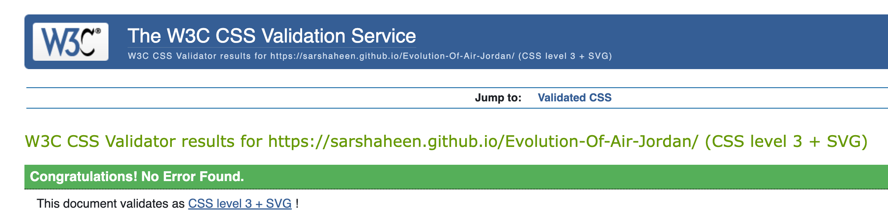

# Evolution Of Air Jordan

The Evolution Of Air Jordan website is for sneaker heads & Air Jordan fanatics to visit and learn about the background of the Jordan brand. It also displays the various sneakers that have been released and how they’ve changed over the years.

Users will be able to find the history of Jordan as well as images of the different sneakers and a sign up form to stay up to date with. It is targeted towards people who have a interest in the Air Jordan legacy and are curious to learn more.

## Features

- __Navigation__

The navigation bar that appears at the top of the page, shows the website name in the top left.

To the right of the navigation bar is the History, Sneakers & Sign Up links which will take the user to another page within the site.

The color used in the font works well with the background and the font used is in a style that looks like laces. 

It is clearly displayed and allows the user to navigate through the links with ease.

- __Landing Page__

The landing page shows a image of the air jordan logo with text overlaying to cleary show where they are on the site.

This welcomes them to the Evolution Of Air Jordan website and has a animation to make the experience enjoyable.

- __History Section__

The History section will allow the user to read 2 short paragraphs about how Air jordan was founded and how it has changed over the years.

- __Footer Section__

The Footer contains links to Evolution of Air Jordans social media sites. The links open in new tabs which allows the user to easily navigate back to the original webpage.

It promotes users to interact with the site through aditional sources.

- __Sneakers page__

The sneakers page displays images of the different type of Air Jordans produced and what they look like.

It is an important section as it shows how each pair differentiate from one another and how they have been designed.

- __Sign Up Form__

The sign up section contains a form that collects users details and let's them sign up for a newsletter that will keep them up to date when the site is updated.

It asks them to submit their full name and email address.

## Testing

I have tested this website in different browsers to ensure it works with Chrome,Safari etc...

I have ensured  this project is responsive and functional on all screen sizes by using devtools toolbar.

I confirm that the all text throughout the site is visable and the links are accessible to users. 

I have made sure that the sign up form will only submit once vaild details are entered.

### Bugs

I ran into a problem where the first media query for the sneakers page was not running but after looking through the code, i realised that i was missing the closing bracket. After adding it, the code ran smoothly.

### Validator Testing

- __HTML__

I will confirm no errors are returned after passing the offical W3C validator.

- __CSS__

I will confirm no errors are returned after passing the Jigsaw validator.

### Unfixed Bugs

No unfixed bugs.

## Deployment

This site will be deployed to Github pages. The steps to deploy are as follows:

- In the GitHub repository, navigate to the Settings tab.
- From the source section drop-down menu, select the Main Branch.
- Once the main branch has been selected, the page will provide a link to the deployed website to view.

The live link -
<a href="https://sarshaheen.github.io/Evolution-Of-Air-Jordan/" target="_blank" rel="noopener" aria-label="Visit Evolution Of Air Jordan (opens in a new tab)">Click Here!</a>

## Credits

Information relating to Air Jordan History was taken from Wikipedia.

### Contents

The code to create the social media links and logo animation was taken from CI Love Running project.

### Media

The image in the header, footer and sign up form were taken from Unsplash.

The icons used for social media links were taken from Font Awesome.

